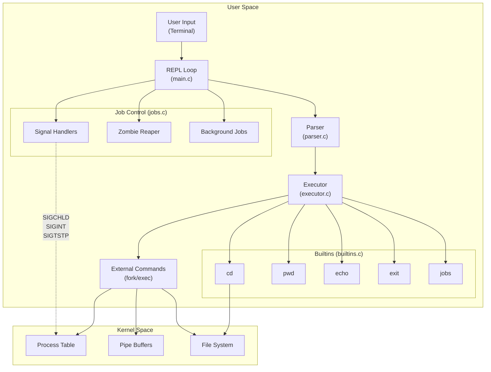
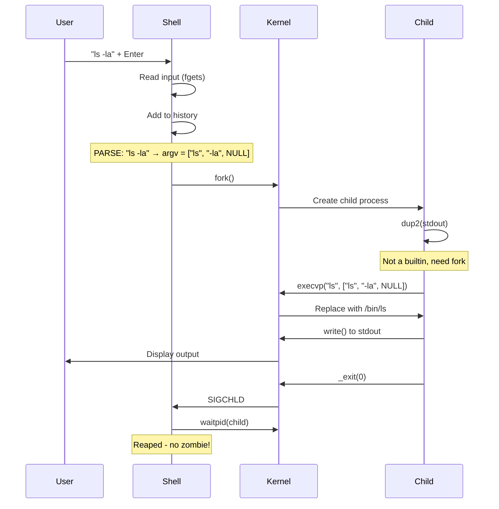
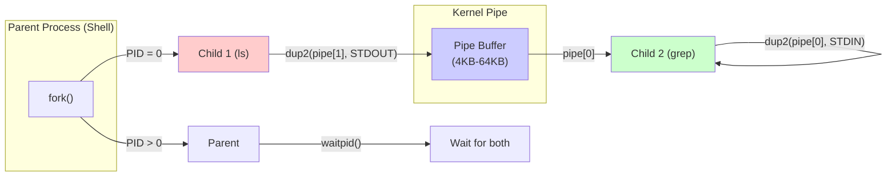

# cshell - Unix Shell Implementation

**A Production-Quality Shell Built from Scratch in C**

---

## Architecture Overview



## Command Execution Flow



## Pipe Implementation



---

# Interview Questions & Code References

## 1. "What happens when you type `ls -la` in a shell?"

### Answer:

```
1. READ: Shell reads "ls -la\n" from stdin via fgets()
2. PARSE: Tokenizes into ["ls", "-la", NULL]
3. LOOKUP: Checks if "ls" is a builtin
4. FORK: Since "ls" is external, fork() creates child process
5. EXEC: Child calls execvp("ls", ["ls", "-la", NULL])
6. WAIT: Parent calls waitpid() to wait for child
7. CLEANUP: Reap zombie with waitpid(-1, WNOHANG)
```

### Code References:

**main.c:859-892** (REPL Loop):
```c
while (1) {
    print_prompt();
    line = read_input();           // 1. READ
    if (line == NULL) break;      // Ctrl+D handling
    if (*line == '\0') continue;  // Empty line
    run_command(line);            // 2. PARSE & EXECUTE
    free(line);
    reap_zombies(&shell_state);   // 7. CLEANUP ZOMBIES
}
```

**main.c:807-845** (run_command):
```c
void run_command(const char *input) {
    add_to_history(&shell_state, input);     // Add to history
    cmd = parse(input);                       // 2. PARSE
    if (cmd == NULL) return;
    status = execute_command(&shell_state, cmd); // 3-6. EXEC
    shell_state.last_exit_status = status;   // Track $?
    free_command(cmd);                        // Cleanup
}
```

**executor.c:107-214** (fork/exec pattern):
```c
pid = fork();                              // 4. FORK
if (pid < 0) { perror("fork"); return; }
if (pid == 0) {
    execvp(args[0], args);                 // 5. EXEC
    _exit(127);                            // Only if exec fails
}
waitpid(pid, &status, 0);                   // 6. WAIT
```

---

## 2. "What is a zombie process and how do you prevent it?"

### Answer:

**Zombie = Dead process that hasn't been wait()ed on**

When a process dies, it becomes a "zombie" until the parent calls `wait()`. The zombie still occupies an entry in the process table. Too many zombies = "out of process slots" error.

### Prevention:

```c
// ALWAYS call wait/waitpid after fork!
pid = fork();
if (pid > 0) {
    waitpid(pid, &status, 0);  // Prevents zombie
}
```

### Code References:

**jobs.c:277-290** (Zombie Reaper):
```c
void reap_zombies(shell_t *shell) {
    pid_t pid;
    int status;
    
    // WNOHANG = return immediately if child hasn't exited
    // -1 = wait for any child process
    while ((pid = waitpid(-1, &status, WNOHANG)) > 0) {
        update_job_status(shell, pid, status);  // Update job list
        remove_job(shell, pid);                   // Remove from list
    }
}
```

**executor.c:193-206** (Wait in simple_execute):
```c
/*
 * INTERVIEW QUESTION: What is a zombie process?
 * - A process that has terminated but hasn't been wait()ed on
 * - Still has entry in process table (PID, exit status)
 * - Defunct process - can't be killed (already dead!)
 * 
 * SOLUTION: Always call wait/waitpid after fork!
 */
waitpid(pid, &status, 0);
```

---

## 3. "Why can't `cd` be an external command?"

### Answer:

**Because `cd` must modify the shell's working directory, not its own.**

```
WRONG: cd as external command
┌─────────────────────────────────────┐
│ Shell Process                       │
│   cwd = /home/user                   │
│                                     │
│   fork() → cd process               │
│     cwd = /tmp  (CHILD changes!)   │
│   exit()                            │
│                                     │
│ Shell still at /home/user ❌        │
└─────────────────────────────────────┘

RIGHT: cd as builtin
┌─────────────────────────────────────┐
│ Shell Process                       │
│   cwd = /home/user                   │
│                                     │
│   cd /tmp    (runs IN shell!)       │
│   cwd = /tmp  (SHELL changes!)     │
│                                     │
│ Shell now at /tmp ✅                 │
└─────────────────────────────────────┘
```

### Code References:

**builtins.c** (All builtins run in parent process):
```c
int builtin_cd(shell_t *shell, char **argv) {
    if (argv[1] == NULL) {
        argv[1] = getenv("HOME");  // cd without args → HOME
    }
    
    if (chdir(argv[1]) != 0) {    // chdir() changes SHELL's cwd!
        perror("cd");
        return 1;
    }
    
    // Update PWD environment variable
    update_pwd_env();
    return 0;
}
```

**executor.c:837-893** (Builtins run without fork):
```c
int execute_command(shell_t *shell, command_t *cmd) {
    if (is_builtin(cmd->argv[0])) {
        // NO FORK! Runs IN the shell process
        // Can modify shell state (cwd, env vars)
        return execute_builtin(shell, cmd);
    }
    // External commands: must fork
    return execute_pipeline(shell, cmd);
}
```

---

## 4. "Explain how pipes work at the OS level"

### Answer:

A **pipe** is a kernel-managed buffer connecting two processes:

```
┌─────────────────────────────────────────────────────────────┐
│                    KERNEL SPACE                             │
│                                                             │
│   ┌─────────────────────────────────────────────────────┐   │
│   │              PIPE BUFFER (4KB-64KB)                 │   │
│   │                                                      │   │
│   │   Bytes written here ────────────────────────────   │   │
│   │   ◀──────────────── Read from here                  │   │
│   │                                                      │   │
│   └─────────────────────────────────────────────────────┘   │
│          ↑                         ↑                       │
│          │                         │                       │
│    pipefd[1] (write)         pipefd[0] (read)             │
│                                                             │
└─────────────────────────────────────────────────────────────┘
         │                                       │
         ↓                                       ↓
┌─────────────────────┐               ┌─────────────────────┐
│   ls PROCESS        │               │   grep PROCESS     │
│                     │               │                     │
│   stdout ───────────┼───────────────┼── stdin            │
│   (pipefd[1])       │               │   (pipefd[0])      │
└─────────────────────┘               └─────────────────────┘
```

### Key System Calls:

1. `pipe(pipefd)` - Creates pipe, returns `[read_fd, write_fd]`
2. `fork()` - Creates child process (both inherit pipe fds)
3. `dup2(new_fd, old_fd)` - Redirect stdin/stdout to pipe
4. `close(fd)` - Close unused pipe ends (prevents EOF blocking)

### Code References:

**executor.c:300-469** (Full pipe implementation):
```c
void execute_piped(char **left_args, char **right_args) {
    int pipefd[2];
    
    // 1. CREATE PIPE
    pipe(pipefd);  // pipefd[0]=read, pipefd[1]=write
    
    // 2. FORK LEFT PROCESS (producer)
    left_pid = fork();
    if (left_pid == 0) {
        // Redirect stdout TO pipe
        dup2(pipefd[1], STDOUT_FILENO);
        // CRITICAL: Close unused ends
        close(pipefd[0]);  // Left doesn't read
        close(pipefd[1]);  // Already redirected via dup2
        execvp(left_args[0], left_args);
    }
    
    // 3. FORK RIGHT PROCESS (consumer)
    right_pid = fork();
    if (right_pid == 0) {
        // Redirect stdin FROM pipe
        dup2(pipefd[0], STDIN_FILENO);
        close(pipefd[1]);  // Right doesn't write
        close(pipefd[0]);  // Already redirected via dup2
        execvp(right_args[0], right_args);
    }
    
    // 4. PARENT: Close both ends, wait for children
    close(pipefd[0]);
    close(pipefd[1]);
    waitpid(left_pid, NULL, 0);
    waitpid(right_pid, NULL, 0);
}
```

### Why Close Unused Pipe Ends?

```c
// WRONG: Not closing pipefd[1] in grep
grep process:
  stdin = pipefd[0]   ✓ reads from pipe
  stdout = terminal  ✓ writes to terminal
  pipefd[1] = STILL OPEN  ❌
  
// Result: grep will NEVER see EOF!
// EOF only comes when ALL write ends are closed.
// grep hangs forever waiting for more input.
```

---

## 5. "What is a file descriptor?"

### Answer:

A **file descriptor (fd)** is an integer that uniquely identifies an open file/stream in a process.

```
┌─────────────────────────────────────────────────────────────┐
│                 PROCESS FILE DESCRIPTOR TABLE               │
│                                                             │
│   fd 0: stdin  ──────────────► Keyboard / Pipe / File       │
│   fd 1: stdout ──────────────► Terminal / Pipe / File       │
│   fd 2: stderr ──────────────► Terminal                     │
│   fd 3: pipefd[0] ──────────► Kernel Pipe Buffer (read end) │
│   fd 4: pipefd[1] ──────────► Kernel Pipe Buffer (write end)│
│   fd 5: /etc/passwd ────────► Open file                    │
│                                                             │
└─────────────────────────────────────────────────────────────┘
```

### Default File Descriptors:

| FD | Name | Default Target |
|----|------|----------------|
| 0 | stdin | Keyboard |
| 1 | stdout | Terminal |
| 2 | stderr | Terminal |

### Key System Calls:

- `open(path, flags)` - Opens file, returns fd
- `read(fd, buf, n)` - Read from fd
- `write(fd, buf, n)` - Write to fd
- `dup2(old_fd, new_fd)` - Duplicate fd (redirect!)
- `close(fd)` - Close fd

### Code References:

**executor.c:555-582** (Redirection with fd save/restore):
```c
int handle_redirection(char **args) {
    // KEY FIX: Save original stdout BEFORE redirecting
    int saved_fd = dup(STDOUT_FILENO);  // Copy fd 1
    
    // Open file, get new fd
    int fd = open(filename, O_WRONLY | O_CREAT | O_TRUNC, 0644);
    
    // REDIRECT: stdout now points to file!
    dup2(fd, STDOUT_FILENO);  // fd 1 now writes to file
    close(fd);                 // Don't need original fd
    
    simple_execute(args);      // Command writes to file
    
    // KEY FIX: RESTORE original stdout
    dup2(saved_fd, STDOUT_FILENO);  // fd 1 back to terminal
    close(saved_fd);
    
    // Without restore, ALL printf() calls would go to file!
}
```

**The dup2 Magic:**
```c
// Before dup2():
//   fd 1 → terminal
//   fd 5 → file.txt
//
// dup2(5, 1):
//   fd 1 → file.txt  (redirected!)
//   fd 5 → file.txt
//
// Now anything writing to stdout (fd 1) goes to file.txt!
```

---

# Impressive Features to Add

## 1. Command History with Arrow Keys

**What it does:** Press ↑ to see previous commands, ↓ to go forward

**Why impressive:**
- Makes shell interactive like bash/zsh
- Shows understanding of terminal control codes
- Requires non-blocking input or signal-driven input

**Implementation approach:**
```c
// Option 1: Readline library (easy)
#include <readline/readline.h>
#include <readline/history.h>
char *line = readline("prompt$ ");
add_history(line);

// Option 2: Manual implementation (harder)
struct termios old_settings;
tcgetattr(STDIN_FILENO, &old_settings);
// Set raw mode
// Read arrow key escape sequences
// Up arrow: "\033[A", Down: "\033[B"
```

## 2. Tab Completion

**What it does:** Press Tab to auto-complete commands and file paths

**Why impressive:**
- Core feature of professional shells
- Requires readline or manual escape sequence handling
- Shows understanding of filesystem APIs

**Implementation:**
```c
void complete_command(char *partial, char **matches, int *count) {
    // 1. Get all commands in PATH
    // 2. Filter by prefix match
    // 3. If single match, complete
    // 4. If multiple, show options
    
    // For file completion:
    // glob(partial + "*", GLOB_MARK, NULL, &g);
}
```

## 3. Environment Variables ($PATH, $HOME, etc.)

**What it does:** Expand `$VAR` syntax, manage environment

**Why impressive:**
- Shows understanding of process environment
- Enables configuration like real shells
- Required for scripts

**Implementation:**
```c
char *expand_variables(const char *input) {
    char result[MAX_LINE];
    char *p = input;
    
    while (*p) {
        if (*p == '$') {
            p++;
            char var_name[64], *value;
            // Extract variable name
            // getenv(var_name) to get value
            strcat(result, value);
        } else {
            strncat(result, p, 1);
        }
        p++;
    }
    return strdup(result);
}
```

---

# Resume Bullet Points

## Option 1 (Technical Depth):
> Built a Unix shell from scratch in C implementing fork/exec, pipes, I/O redirection, and signal handling with detailed inline comments explaining operating system concepts for educational purposes.

## Option 2 (Impact-Focused):
> Developed a fully functional Unix shell with job control, pipes, and redirections, serving as both a working program and comprehensive resource explaining OS fundamentals through annotated code.

## Option 3 (Comprehensive):
> Created cshell (github.com/Ocdeed/cshell), a modular Unix shell featuring REPL architecture, process management via fork/exec, IPC through kernel pipes, zombie prevention with waitpid, and proper signal handling for Ctrl+C/Ctrl+Z interruption - documented with detailed educational comments on every system call.

---

# Project Structure Reference

```
cshell/
├── include/
│   ├── shell.h      # Core types: shell_t, command_t, job_t
│   ├── parser.h     # parse(), parse_input()
│   ├── executor.h   # execute_command(), simple_execute()
│   ├── builtins.h   # builtin_cd(), builtin_exit(), etc.
│   └── jobs.h       # add_job(), reap_zombies(), signal handlers
├── src/
│   ├── main.c       # REPL loop (Read-Eval-Print)
│   ├── parser.c    # Tokenization, command parsing
│   ├── executor.c   # fork/exec/wait, pipes, redirections
│   ├── builtins.c   # Commands that run in parent process
│   └── jobs.c      # Background jobs, signals, zombies
└── Makefile        # Build system
```

---

# Key Learning Points Summary

| Concept | Location | Interview Relevance |
|---------|----------|---------------------|
| fork() creates copy | executor.c:107 | How processes are created |
| execvp() replaces process | executor.c:155 | How programs run |
| waitpid() prevents zombies | executor.c:206 | Process cleanup |
| pipe() creates IPC | executor.c:316 | Inter-process communication |
| dup2() redirects FDs | executor.c:356 | File descriptors |
| chdir() vs fork | builtins.c:117 | Why builtins exist |
| SIGCHLD handling | jobs.c:343 | Async process termination |
| strdup() for strings | main.c:223 | Memory ownership |
